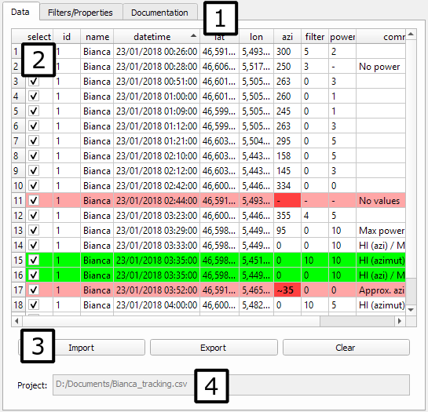

# Radiotrack (v0.9)

Welcome to the Radiotrack's documentation. See also the QGIS
[plugin page](http://plugins.qgis.org/plugins/Radiotrack/).

## Feature Summary

- Import and export CSV files
- Create map layers showing the measures (points and bearings)
- Indicate errors in the data
- Automatic map updates when changing the data
- Filter measures based on individuals and dates
- Highlight biangulations
- Alerts given with QGIS' message bar
- Detailed information is logged into QGIS' standard window

## Purpose

This plugin was developed to help viewing and correcting manual
telemetric data. The first users were measuring signals from a
radioemitter on a bat at night. With the direction and the strength of
the signal, they could guess where the bat was.

The data is stored in CSV files and consists of latitude-longitude
coordinates, an azimuth and the strength of the signal. When filling
those files, the users can do mistakes, thus making the data unusable.
When importing a CSV file, the plugin indicates which data is
erroneous and enables the user to correct it.

## Main Features

The plugin has a graphical user interface that is brought up by either
using the _Ctrl+Alt+B_ keyboard shortcut or by clicking on
the black bat icon in the toolbar. Alternatively, you can reach the
plugin through QGIS' "Plugins" menu, by selecting "Radiotrack", and
"Open/close Radiotrack".

After importing a file, two map layers are created: one drawing dots
where measures were taken, and one drawing lines indicating in which
direction the measured signal comes from. If the data contains errors,
some dots or lines won't be drawn until the errors are corrected.

The table can be edited to correct the errors. Once everything is
fine, you can export the data as a CSV file. Filters are here to help
you find and select the most useful data.

## Plugin Layout

The following image shows the plugin on its main tab with numbers
marking the useful parts.

### Tabs

The plugin has different tabs, indicated by [1]. This documentation is
in the "Documentation" tab. The main tab ("Data") was selected for the
screenshot.

### Data Table

The table, indicated by [2], shows the data you are working with. If
you have pink lines, it means that they contain errors. Errors are
shown in red. These cells contain data that can't be understood. You
can select a cell and type to input valid data. When hitting the Enter
key or leaving the cell, its content will be checked. If it is valid,
the red goes away, and the pink too if the line no longer contains
errors. Also, the map will be updated. This is actually true for the
"datetime", "lat", "lon" and "azi" columns. The other columns are not
checked and can contain anything.

Greens rows indicate measures taken at the same time for the same
radioemitter. It is a visual help for finding the most meaningful
data. You may sort by datetime by clicking on "datetime" at the top of
the table if your measures aren't already sorted in order to see packs
of green lines.

### Controls

There are three buttons below the table, marked by [3]. The "Import"
button lets you select a CSV file so you can start working with its
data.

The button "Export" will let you save your edited data as a CSV file.
Note that only the selected lines are exported.

The button "Clear" will remove the table and the two layers, as if you
didn't even use the plugin yet.

### Project

The "Project" field indicated by [4] is used to remind you which file
you imported. However, if you edit the table, its content will no
longer match the file's data, so don't forget to export your table.

## Filters and Settings

The second tab enables you to decide which and how data are displayed.

### Filters

Filters let you see only data you want. The irrelevant measures are
hidden in the table and on the map. You'll need to change the filters
for them to reappear. You can also click on the "Reset filters" button
to erase your filters and show all the data again.

#### Id

This field lets you select a radioemitter's identifier so its measures
only will be shown. The option "All" won't hide anything.

#### Datetime

This filter is made of two datetimes. Only measures taken between
these two times (included) will be shown. After importing or resetting
the filters, the "From" field will contain the oldest time from your
table, and the "To" one will contain the most recent time.

You can click on numbers you wish to change, and type the new ones.
However, if you use the up or down arrows (from your keyboard or the
fields) in the "From" field, 1 will be added or substracted to the
current number in <em>both</em> fields. You can use that, for example,
to define a range of 1 hour and 15 minutes, put your cursor on the
hour of the "From" field, and browse through a long series of measures
with the arrows.

#### Keep only

Those are extra filters to hide measures that are not valid or
interesting. For example, checking "Valid position" will hide the
measures where the "lat" and/or "lon" cells are red.

### Settings

A few tweaks are available for the plugin.

#### Segment Length

This parameter controls the length of the lines on the map.

#### Datetime format

Changes how the dates and times are displayed in the plugin.

#### CRS

Changes the Coordinate Reference System of your data. The default one,
EPSG:4326, is the current standard for GPS coordinates. However, if
you want to use a different system, you can set your CRS in the bottom
right corner of QGIS and select the "Project CRS" option in this
plugin.

## Shortcuts

| Shortcut         | Effect                  |
| ---------------- |-------------------------|
| Ctrl + Alt + B   | Open/Close the plugin   |
| Ctrl + Alt + I   | Import a new file     * |
| Ctrl + Alt + X   | Export selected items * |
| Ctrl + Alt + C   | Clear the loaded data * |
| Ctrl + Page Down | Go to the next tab      |
| Ctrl + Page Up   | Go to previous tab      |
| F2               | Edit cell               |

*: only available on the "Data" tab

## CSV files format

The plugin works with CSV files. Most spreadsheet software can export
to this format.

The first line of the spreadsheet must be a header. Instead of
containing data, its cells hold the name of the columns' data. The
plugin requires the following header (and columns), in that order:

- id: a name or number identifying the radioemitter that was measured
  (not "All").
- datetime: time when the signal was measured. Example: 2018-01-23
  03:48:00.
- lat: latitude (North) of the antenna when measuring.
- lon: longitude (East) of the antenna when measuring.
- azi: azimuth, angle in [0, 360[ indicating where the signal came from.
- possible additional columns such as comments you want to associate
  with the data.

## Authors

- Bello Fernando
- Boisson Romain
- Cabodi Alexis
- [Canon Louis-Claude](http://lccanon.free.fr/)
- Jeannin Emile
- Moyikoulou Chris-Féri
- Wetzel Anthony
